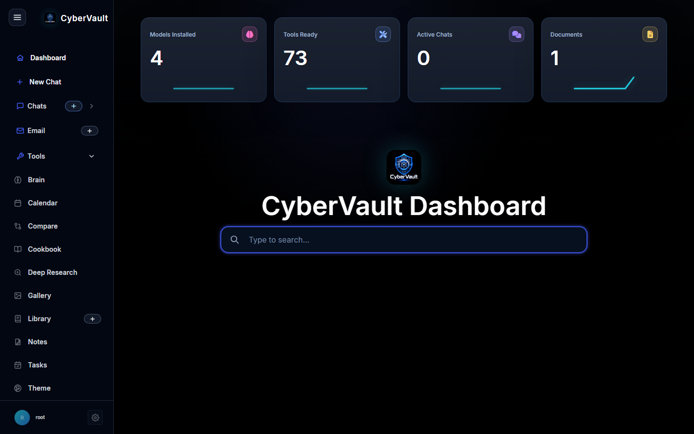
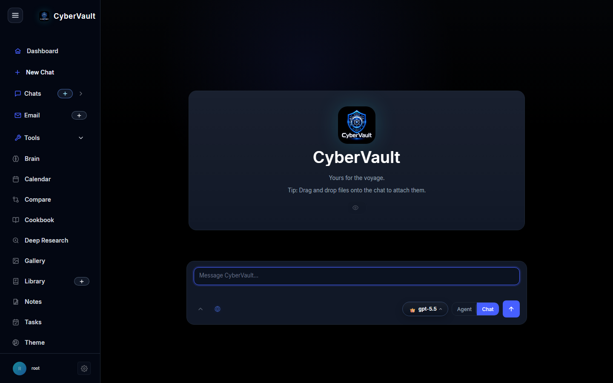
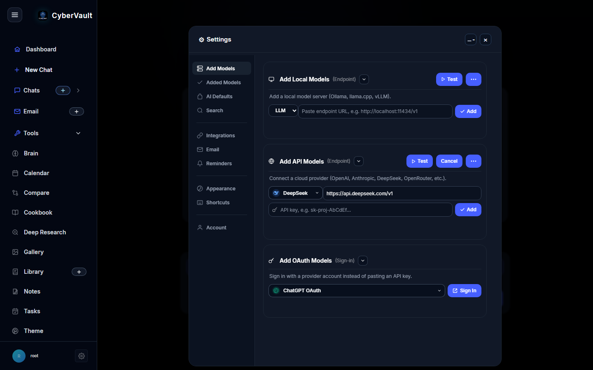

# CyberVault

CyberVault is a self-hosted AI workspace with chat, model management, document tools, email helpers, calendar tools, research workflows, galleries, notes, tasks, and provider integrations. It is built for people who want a private control center for local models, cloud LLM APIs, and daily AI workflows.



## Features

- Dark CyberVault dashboard with live model, tool, chat, and document overview cards.
- Chat workspace with model selection, agent/chat modes, attachments, and document helpers.
- Model setup for local endpoints, API providers, and OAuth-style provider flows.
- Built-in pages for email, calendar, compare, cookbook, deep research, gallery, library, notes, tasks, and theme controls.
- Docker Compose stack with CyberVault, ChromaDB, and SearXNG.

## Screenshots

### Dashboard


### Chat



### Settings / Add Models



## Requirements

Recommended:

- Docker and Docker Compose
- 4 GB RAM minimum, 8 GB or more recommended
- A local or remote model provider
- Optional: Ollama for local models
- Optional: API keys for OpenAI, Anthropic, DeepSeek, OpenRouter, Brave, Tavily, Serper, or Google PSE

Manual Python install:

- Python 3.11 or newer
- `pip`
- A C/C++ build toolchain may be required by some optional packages

## Quick Start With Docker

1. Clone the repository:

   ```bash
   git clone https://github.com/cyberfox1337x/CyberVault.git
   cd CyberVault
   ```

2. Create your environment file:

   ```bash
   cp .env.example .env
   ```

3. Edit `.env`:

   - Change `ODYSSEUS_ADMIN_USER`.
   - Change `ODYSSEUS_ADMIN_PASSWORD`.
   - Add any provider keys you use.
   - Keep unused provider keys blank.

4. Start CyberVault:

   ```bash
   docker compose up -d --build
   ```

5. Open the app:

   ```text
   http://localhost:7000
   ```

6. Sign in with the admin username and password from `.env`.

## Configure `.env`

Important values:

| Variable | Purpose |
| --- | --- |
| `APP_BIND` | Address Docker binds to. Use `127.0.0.1` for local-only or `0.0.0.0` for LAN access. |
| `APP_PORT` | Web port exposed by CyberVault. Default is `7000`. |
| `ODYSSEUS_ADMIN_USER` | Admin login username. |
| `ODYSSEUS_ADMIN_PASSWORD` | Admin login password. Change this before running. |
| `AUTH_ENABLED` | Set to `true` for login protection. |
| `OPENAI_API_KEY` | Optional OpenAI API key. |
| `ANTHROPIC_API_KEY` | Optional Anthropic API key. |
| `DEEPSEEK_API_KEY` | Optional DeepSeek API key. |
| `OPENROUTER_API_KEY` | Optional OpenRouter API key. |
| `OLLAMA_BASE_URL` | Optional Ollama endpoint, usually `http://host.docker.internal:11434` from Docker. |
| `SEARXNG_INSTANCE` | SearXNG URL used for private web search. |
| `DATABASE_URL` | Database connection. Default uses local SQLite under `./data`. |

Never commit your real `.env` file.

## Run Without Docker

Docker is the easiest path. If you want to run directly with Python:

```bash
python -m venv .venv
source .venv/bin/activate
pip install -r requirements.txt
cp .env.example .env
python -m uvicorn app:app --host 127.0.0.1 --port 7000
```

On Windows PowerShell:

```powershell
python -m venv .venv
.\.venv\Scripts\Activate.ps1
pip install -r requirements.txt
Copy-Item .env.example .env
python -m uvicorn app:app --host 127.0.0.1 --port 7000
```

## Updating

To update an existing Docker install:

```bash
git pull
docker compose pull
docker compose up -d --build
```

Your local data should remain in `./data` and logs in `./logs`, unless you changed those paths in `.env`.

## Branches

- `main` is the stable branch for users.
- `dev` is for development and testing before changes are promoted to `main`.

For normal use, install from `main`.

## Security

CyberVault is designed as a self-hosted workspace so your chats, documents, provider settings, and local workflow data stay under your control.

- Login protection can be enabled with `AUTH_ENABLED=true`.
- Admin credentials and provider keys are loaded from `.env` instead of being hard-coded into the source.
- Runtime folders such as `data`, `logs`, backups, caches, databases, and real environment files are ignored by Git.
- The Docker stack keeps CyberVault, ChromaDB, and SearXNG organized as separate services.
- Provider integrations are optional, so you can run only the local or cloud connections you choose to configure.
- `.env.example` is included as a safe template; your real `.env` stays private on your machine or server.

## Credits

CyberVault is inspired by the Odysseus project and its idea of a self-hosted AI command center. Credit goes to Odysseus for the original concept direction and design inspiration that helped shape CyberVault into a darker, security-focused workspace.
